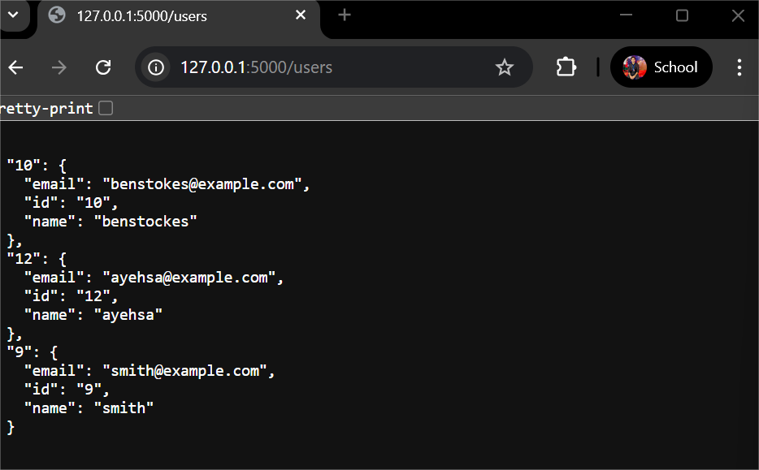

# Flask User API 🧑‍💻

A simple RESTful API built with Flask that performs **CRUD operations** (Create, Read, Update, Delete) for managing users using an in-memory dictionary.

## 🚀 Features

- Create a new user
- Retrieve all users
- Retrieve a single user by ID
- Update an existing user
- Delete a user

## 🧠 Tools & Technologies
- Python 3.13.5
- VS Code
- Flask
- Postman (for testing requests)
- In-memory dictionary for user data

## 🔗 Base URL

http://127.0.0.1:5000/users

## How to Use Postman to Test the API
- Step 1: Open Postman and start a new request
- Step 2: Change the method from `GET` to `POST`, `GET`, `PUT`, or `DELETE` depending on the operation you want to perform.
- Step 3: Enter the request URL: http://127.0.0.1:5000/users
- Step 4: Set Headers (for POST/PUT), Key: Content-Type , Value: application/json
- Step 5: Go to the **Body** tab, Select `raw`, Choose `JSON` from the dropdown
- Enter your JSON data, for example:
{
   "id": "1",
  "name": "Alice",
  "email": "alice@example.com"
}
- Step 6: Click "Send"

## Visualizations

