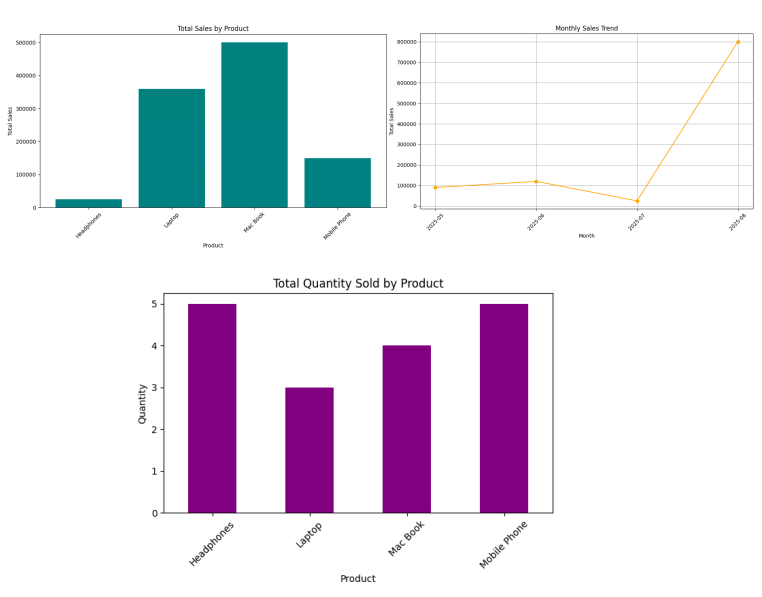

# 📊 Sales Data Analysis Dashboard

This project analyzes sales data using **Python**, with visualizations for:
- Total sales by product
- Monthly sales trend
- Quantity sold by product

It uses the power of `pandas` for data manipulation and `matplotlib` for plotting charts.

## 🔍 Features

- Load and clean CSV data
- Analyze monthly and product-based sales
- Visualize data using bar and line charts
- Export grouped summaries (optional)
  
## 📈 Technologies Used
- Python
- Pandas 
- Matplotlib
- Jupyter Notebook

## 📁 Repository Contents

- Task_05.py  (Main Python script)
- Charts.png (plotting of data)
- sales_data.csv (csv excel file to fetch data)
- README.md  (This readme file)

## Visualizations

