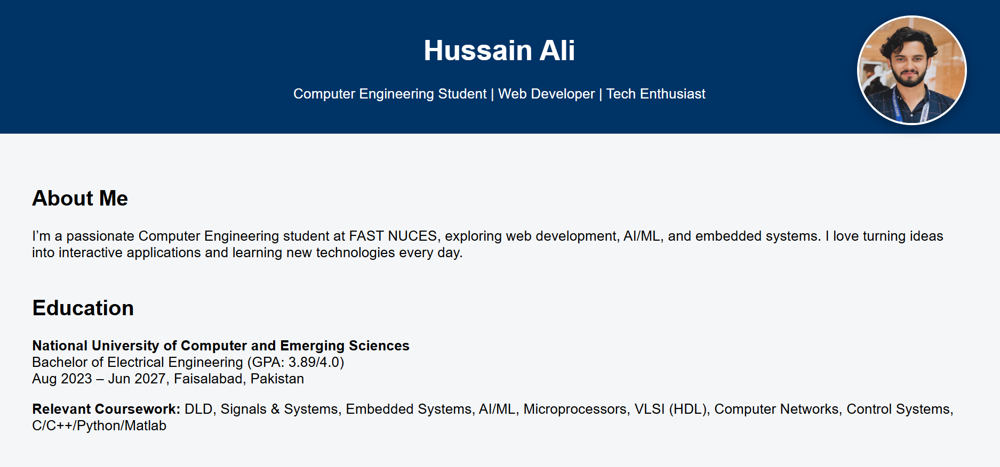
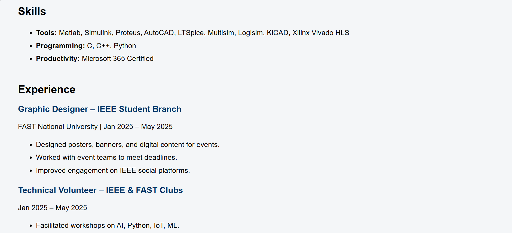
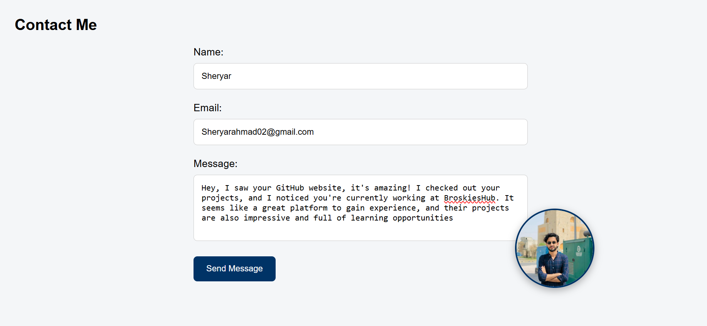
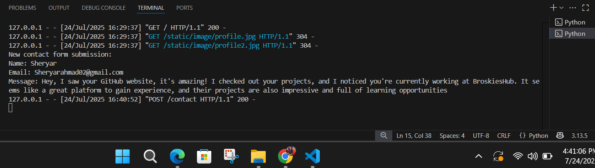

# 🌐 Personal Portfolio Website

A simple yet elegant personal portfolio website built using **Flask (Python Web Framework)**, **HTML**, **CSS**, and **Python**.  
This project showcases your skills, projects, and contact information on a responsive, customizable webpage.

## 🚀 Features

- Responsive and clean user interface
- Displays a profile picture (top and bottom)
- Contact form layout
- Projects section (detailed with bullets and formatting)
- Easy to deploy locally with Flask
- Modular code with separate static and template directories

## 🛠️ Technologies Used

- **Python 3**
- **Flask**
- **HTML5**
- **CSS3**
- **Jinja2** 
- **VS Code** (for development)

## 📁 Project Structure

## 📂 Add Your Own Content

- Update your image files in static/image/.
- Modify the text in templates/index.html (Name, Projects, Contact Info).
- Change styles via static/style.css.

## 📸 Visualization

