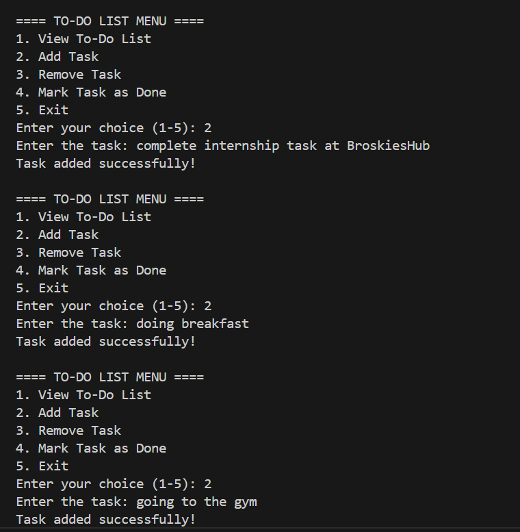
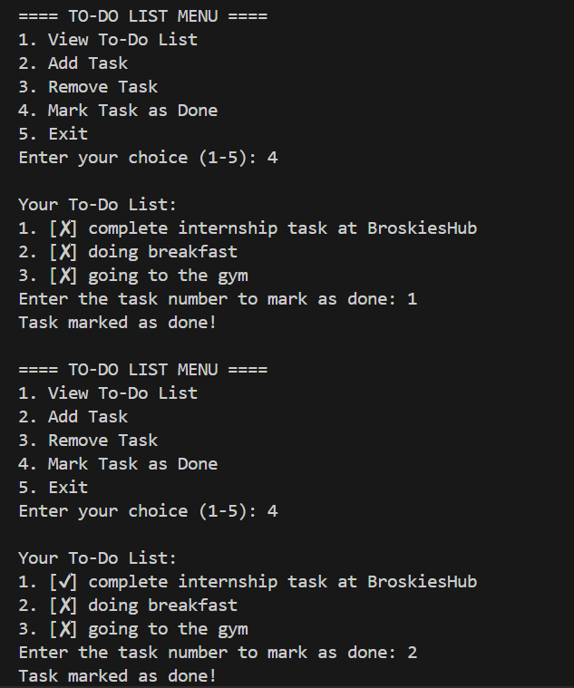

# ✅ Console-Based To-Do List Application

This is a simple **console-based To-Do List** application written in **Python**.  
It allows users to manage their daily tasks by **adding, viewing, removing**, and **marking tasks as done** through an interactive terminal menu.

## 📌 Features

- ➕ Add new tasks  
- 📋 View current task list  
- 🗑️ Remove tasks  
- ☑️ Mark tasks as completed  
- ♻️ Clean and user-friendly CLI

## 🎯 Purpose

This project is aimed at **beginners** learning programming.  
It teaches core concepts including:

- Lists
- Loops
- Functions
- Conditionals
- Console input/output

## 🛠️ Tools Used

- Python 3  
- VS Code 

## ▶️ How to Run

1. Make sure Python 3.13.5 is installed.  
2. Save the script as `Task_02.py`.  
3. Run the file in your terminal:

## 📂 Project Structure

- Task_02.py  (Main script file)
- 01.png   (Commandline Screenshot)
- 02.png   (Commandline Screenshot)
- README.md  ( readme file about project details)

## Visualization

